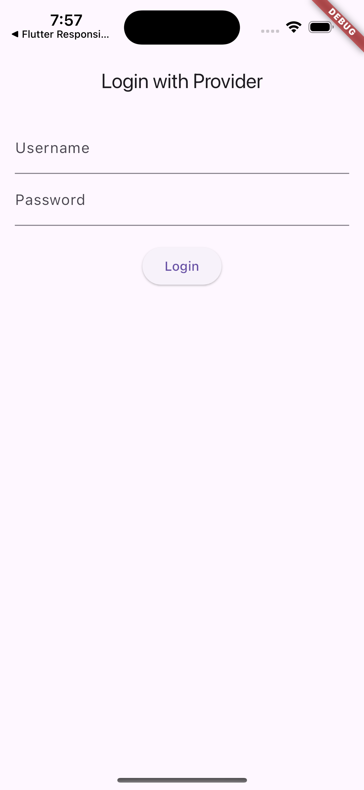
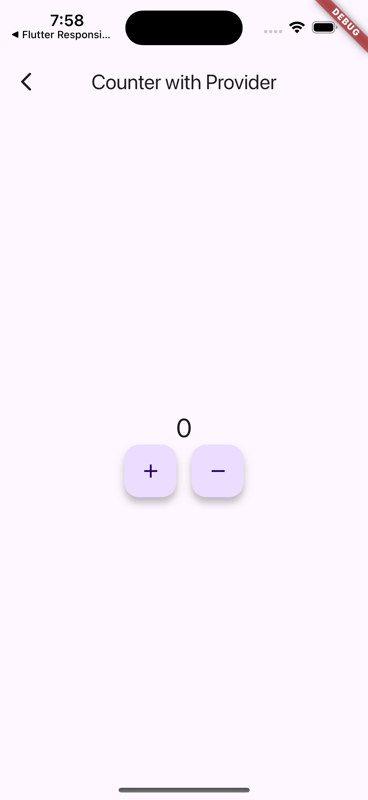

# Flutter State Management Patterns

Este repositorio contiene un proyecto Flutter desarrollado utilizando tres patrones de manejo de estado diferentes: **Provider**, **MVVM**, y **BLoC**. Cada carpeta en este repositorio contiene una implementación del mismo proyecto utilizando uno de estos patrones.

## Objetivo

El objetivo de este repositorio es mostrar cómo se puede aplicar cada uno de estos patrones para manejar el estado de una aplicación Flutter, destacando las ventajas, desventajas y casos de uso de cada uno.

## Patrones de Manejo de Estado

### 1. Provider

**Descripción**: Provider es un paquete que facilita la inyección de dependencias y la gestión de estados de manera eficiente. Es sencillo de usar y adecuado para aplicaciones de tamaño medio.

**Cuándo usarlo**:

- Aplicaciones pequeñas a medianas donde la complejidad del estado es baja.
- Proyectos donde se requiere una solución rápida y fácil de mantener.

**Cómo aplicarlo**:

- Definir un modelo de datos que represente el estado.
- Usar `ChangeNotifier` para notificar cambios en el estado.
- Utilizar `Provider` y `Consumer` para acceder al estado en los widgets.

**Carpeta**: `arq_provider_app/`

### 2. MVVM (Model-View-ViewModel)

**Descripción**: MVVM es un patrón de diseño que separa la lógica de la aplicación (ViewModel) de la UI (View), mejorando la modularidad y facilitando la prueba del código.

**Cuándo usarlo**:

- Aplicaciones medianas a grandes que requieren una clara separación de responsabilidades.
- Proyectos donde la testabilidad es una prioridad.

**Cómo aplicarlo**:

- Crear una `ViewModel` que maneje la lógica de la aplicación.
- Conectar la `ViewModel` con la `View` a través de un mecanismo de binding, como `ChangeNotifier` o `Streams`.
- Mantener la `View` enfocada solo en la presentación.

**Carpeta**: `arq_mvvm_app/`

### 3. BLoC (Business Logic Component)

**Descripción**: BLoC es un patrón que utiliza Streams y Events para gestionar estados de manera reactiva. Separa completamente la lógica de negocio de la UI, lo que facilita la escalabilidad y el mantenimiento.

**Cuándo usarlo**:

- Aplicaciones grandes o que requieren manejo de estados complejos.
- Proyectos que necesitan una arquitectura bien estructurada y reactiva.

**Cómo aplicarlo**:

- Definir `Events` que representen las acciones del usuario.
- Crear un `BLoC` que maneje estos eventos y emita nuevos estados a través de `Streams`.
- Conectar la UI a los `Streams` para reaccionar a los cambios en el estado.

**Carpeta**: `arq_bloc_app/`

## Estructura del Repositorio

- `arq_provider_app/`: Contiene la implementación usando el patrón Provider.
- `arq_mvvm_app/`: Contiene la implementación usando el patrón MVVM.
- `arq_bloc_app/`: Contiene la implementación usando el patrón BLoC.

## Imágenes del Proyecto

Aquí puedes ver algunas capturas de pantalla del proyecto en funcionamiento:

 
 

## Instalación

Para probar cada implementación, navega a la carpeta correspondiente y ejecuta:

```bash
flutter pub get
flutter run
```
